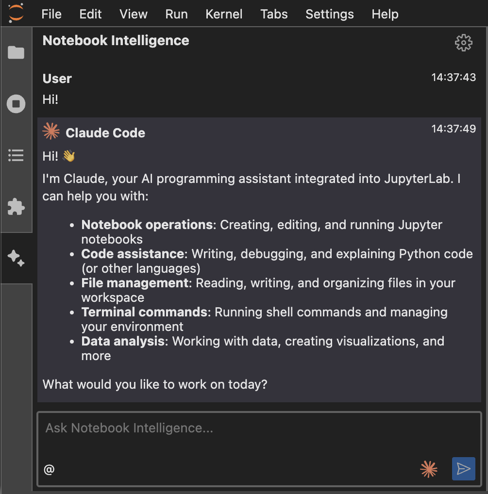
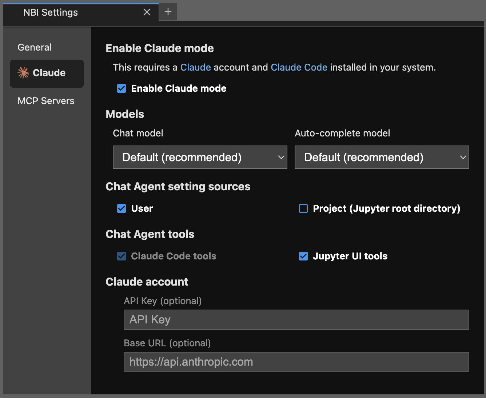
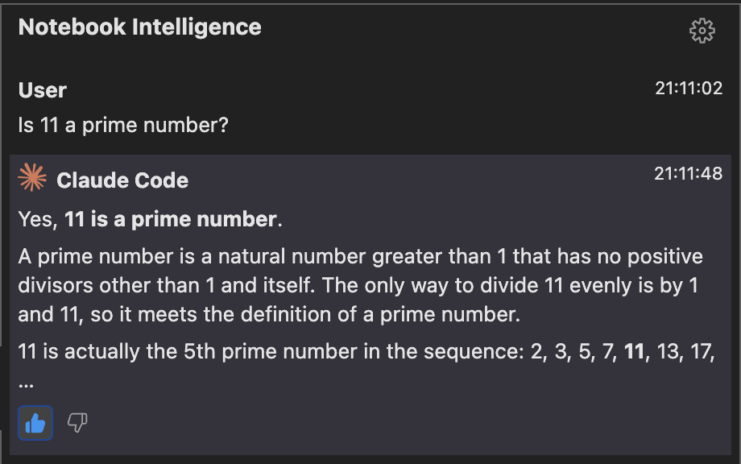

# Notebook Intelligence

Notebook Intelligence (NBI) is an AI coding assistant and extensible AI framework for JupyterLab. It can use GitHub Copilot or AI models from any other LLM Provider, including local models from [Ollama](https://ollama.com/). NBI greatly boosts the productivity of JupyterLab users with AI assistance.

## Feature Highlights

### Claude Mode

Notebook Intelligence provides a dedicated mode for [Claude Code](https://code.claude.com/) integration. In **Claude mode**, NBI uses Claude Code for AI Agent Chat UI and Claude models for inline chat (in editors) and auto-complete suggestions.

This integration brings the AI tools and features supported by Claude Code such as built-in tools, skills, MCP servers, custom commands and many more to JupyterLab.



#### Claude Configuration

You can configure the Claude settings in the NBI Settings dialog. You can access this dialog by using the gear icon in the NBI Chat UI or from JupyterLab Settings menu -> Notebook Intelligence Settings. Toggle the `Enable Claude mode` option to enable Claude mode. The other options are as follows:

- **Chat model**: Select the Claude model to use for Agent Chat UI and inline chat.
- **Auto-complete model**: Select the Claude model to use for auto-complete suggestions.
- **Chat Agent setting sources**: Select the setting sources to use for Claude Code. You can choose to use user settings, project settings or both. These settings are the standard Claude Code settings such as tools, skills, MCP servers, custom commands and many more that are saved in the user's home directory and project directory. See [Claude Code documentation](https://code.claude.com/docs/en/settings) for more details.
- **Chat Agent tools**: Select the tools to activate in the Agent Chat UI. `Claude Code tools` are always activated. `Jupyter UI tools` are the tools that are provided by NBI to interact with JupyterLab UI (authoring notebooks, running cells, etc.).
- **API key**: Enter your Claude API key.
- **Base URL**: Enter your Claude base URL.



#### Resuming a previous Claude session

When Claude mode is enabled, the NBI chat sidebar shows a history icon next to the settings gear. Clicking it opens a picker listing Claude Code sessions recorded for the current JupyterLab working directory (the same transcripts Claude CLI stores under `~/.claude/projects/`). Selecting a session reconnects the Claude client with `resume`, so the next message you send continues that transcript with full prior context.

### Agent Mode

In Agent Mode, built-in AI agent creates, edits and executes notebooks for you interactively. It can detect issues in the cells and fix for you.


### Code generation with inline chat

Use the sparkle icon on cell toolbar or the keyboard shortcuts to show the inline chat popover.

Keyboard shortcuts: `Ctrl + G` / `Cmd + G` is the shortcut to show the inline chat popover and `Ctrl + Enter` / `Cmd + Enter` is the shortcut to accept the suggestion. Clicking `Escape` key closes the popover.


### Auto-complete

Auto-complete suggestions are shown as you type. Clicking `Tab` key accepts the suggestion. NBI provides auto-complete suggestions in code cells and Python file editors.


### Chat interface


See blog posts for more features and usage.

- [Introducing Notebook Intelligence!](https://notebook-intelligence.github.io/notebook-intelligence/blog/2025/01/08/introducing-notebook-intelligence.html)
- [Building AI Extensions for JupyterLab](https://notebook-intelligence.github.io/notebook-intelligence/blog/2025/02/05/building-ai-extensions-for-jupyterlab.html)
- [Building AI Agents for JupyterLab](https://notebook-intelligence.github.io/notebook-intelligence/blog/2025/02/09/building-ai-agents-for-jupyterlab.html)
- [Notebook Intelligence now supports any LLM Provider and AI Model!](https://notebook-intelligence.github.io/notebook-intelligence/blog/2025/03/05/support-for-any-llm-provider.html)

## Installation

NBI requires JupyterLab >= 4.0.0. To install the extension, run the command below and restart JupyterLab.

```bash
pip install notebook-intelligence
```

## Configuration options

### Configuring LLM Provider and models

You can configure the model provider and model options using the Notebook Intelligence Settings dialog. You can access this dialog from JupyterLab Settings menu -> Notebook Intelligence Settings, using `/settings` command in NBI Chat or by using the command palette. For more details, see the [blog post](https://notebook-intelligence.github.io/notebook-intelligence/blog/2025/03/05/support-for-any-llm-provider.html).


Notebook Intelligence extension for JupyterLab

This extension is composed of a Python package named `notebook_intelligence`
for the server extension and a NPM package named `@notebook-intelligence/notebook-intelligence`
for the frontend extension.

### Disabling LLM Providers

By default, all LLM providers can be selected by user dropdown. However, you can disable them and make them controlled by an environment variable.

In order to disable any LLM provider use the `disabled_providers` config:

```python
c.NotebookIntelligence.disabled_providers = ["ollama","litellm-compatible","openai-compatible"]
```

Valid built-in provider values are `github-copilot`, `ollama`, `litellm-compatible`, `openai-compatible`.

In order to disable a built-in provider by default but allow re-enabling using an environment variable use the `allow_enabling_providers_with_env` config:

```python
c.NotebookIntelligence.allow_enabling_providers_with_env = True
```

Then the environment variable `NBI_ENABLED_PROVIDERS` can be used to re-enable specific built-in tools.

```bash
export NBI_ENABLED_PROVIDERS=github-copilot,ollama
```

### Enabling Chat Feedback



You can enable chat feedback by setting the `enable_chat_feedback` config to `true`. You can handle feedback events in your Notebook Intelligence extension code by listening to the `telemetry` events.

```python
c.NotebookIntelligence.enable_chat_feedback = True
```

or by using the command line.

```bash
jupyter lab --NotebookIntelligence.enable_chat_feedback=true
```

### Cell output features

Two cell-output context affordances are user-toggleable in the Settings panel:

- **Troubleshoot errors in output** — a context-menu entry on failed cells that sends the traceback + failing code to the chat model.
- **Ask about this output** — a context-menu entry on cell outputs that attaches `{cell code, output payload}` to the chat sidebar as grounded context.

Per-user preferences (default on):

```python
c.NBIConfig.enable_explain_error = True
c.NBIConfig.enable_output_followup = True
```

Org-wide policy traitlets (override the user preference when set to `force-on` or `force-off`):

```python
c.NotebookIntelligence.explain_error_policy = "user-choice"   # default
c.NotebookIntelligence.output_followup_policy = "user-choice"
```

Equivalent environment-variable overrides:

- `NBI_EXPLAIN_ERROR_POLICY` — `user-choice` | `force-on` | `force-off`
- `NBI_OUTPUT_FOLLOWUP_POLICY` — `user-choice` | `force-on` | `force-off`

When a policy is `force-on` / `force-off`, the corresponding Settings panel checkbox is greyed out with a "Locked by your administrator" tooltip and any client-side write is ignored.

### Remembering GitHub Copilot login

Notebook Intelligence can remember your GitHub Copilot login so that you don't need to re-login after a JupyterLab or system restart. Please be aware of the security implications of using this feature.

> [!CAUTION]
> If you configure NBI to remember your GitHub Copilot login, it will encrypt the token and store into a data file at `~/.jupyter/nbi/user-data.json`. You should never share this file with others as they can access your tokens.
> Even though the token is encrypted, it is done so by using a default password and that's why it can be decrypted by others. In order to prevent that you can specify a custom password using the environment variable `NBI_GH_ACCESS_TOKEN_PASSWORD`.

```bash
NBI_GH_ACCESS_TOKEN_PASSWORD=my_custom_password
```

To let Notebook Intelligence remember your GitHub access token, go to Notebook Intelligence Settings dialog and check the option `Remember my GitHub Copilot access token` as shown below.


If your stored access token fails to login (due to expiration or other reasons), you will be prompted to relogin on the UI.

## Built-in Tools

- **Notebook Edit** (nbi-notebook-edit): Edit notebook using the JupyterLab notebook editor.
- **Notebook Execute** (nbi-notebook-execute): Run notebooks in JupyterLab UI.
- **Python File Edit** (nbi-python-file-edit): Edit Python files using the JupyterLab file editor.
- **File Edit** (nbi-file-edit): Edit files in the Jupyter root directory.
- **File Read** (nbi-file-read): Read files in the Jupyter root directory.
- **Command Execute** (nbi-command-execute): Execute shell commands using embedded terminal in Agent UI or JupyterLab terminal.

### Disabling Built-in tools

All built-in toolas are enabled by default in Agent Mode. However, you can disable them and make them controlled by an environment variable.

In order to disable any built-in tool use the `disabled_tools` config:

```python
c.NotebookIntelligence.disabled_tools = ["nbi-notebook-execute","nbi-python-file-edit"]
```

Valid built-in tool values are `nbi-notebook-edit`, `nbi-notebook-execute`, `nbi-python-file-edit`, `nbi-file-edit`, `nbi-file-read`, `nbi-command-execute`.

In order to disable a built-in tool by default but allow re-enabling using an environment variable use the `allow_enabling_tools_with_env` config:

```python
c.NotebookIntelligence.allow_enabling_tools_with_env = True
```

Then the environment variable `NBI_ENABLED_BUILTIN_TOOLS` can be used to re-enable specific built-in tools.

```bash
export NBI_ENABLED_BUILTIN_TOOLS=nbi-notebook-execute,nbi-python-file-edit
```

### Configuration files

NBI saves configuration at `~/.jupyter/nbi/config.json`. It also supports environment wide base configuration at `<env-prefix>/share/jupyter/nbi/config.json`. Organizations can ship default configuration at this environment wide config path. User's changes will be stored as overrides at `~/.jupyter/nbi/config.json`.

These config files are used for saving LLM provider, model and MCP configuration. Note that API keys you enter for your custom LLM providers will also be stored in these config files.

> [!IMPORTANT]
> Note that updating config.json manually requires restarting JupyterLab to take effect.

### Model Context Protocol ([MCP](https://modelcontextprotocol.io)) Support

NBI seamlessly integrates with MCP servers. It supports servers with both Standard Input/Output (stdio) and Server-Sent Events (SSE) transports. The MCP support is limited to server tools at the moment.

You can easily add MCP servers to NBI by editing the configuration file [~/.jupyter/nbi/mcp.json](#configuration-files). Environment wide base configuration is also support using the file at `<env-prefix>/share/jupyter/nbi/mcp.json`.

> [!NOTE]
> Using MCP servers requires an LLM model with tool calling capabilities. All of the GitHub Copilot models provided in NBI support this feature. If you are using other providers make sure you choose a tool calling capable model.

> [!CAUTION]
> Note that most MCP servers are run on the same computer as your JupyterLab installation and they can make irreversible changes to your computer and/or access private data. Make sure that you only install MCP servers from trusted sources.

### MCP Config file example

```json
{
  "mcpServers": {
    "filesystem": {
      "command": "npx",
      "args": [
        "-y",
        "@modelcontextprotocol/server-filesystem",
        "/Users/mbektas/mcp-test"
      ]
    }
  }
}
```

You can use Agent mode to access tools provided by MCP servers you configured.

For servers with stdio transport, you can also set additional environment variables by using the `env` key. Environment variables are specified as key value pairs.

```json
"mcpServers": {
    "servername": {
        "command": "",
        "args": [],
        "env": {
            "ENV_VAR_NAME": "ENV_VAR_VALUE"
        }
    },
}
```

Below is an example of a server configuration with Streamable HTTP transport. For Streamable HTTP transport servers, you can also specify headers to be sent as part of the requests.

```json
"mcpServers": {
    "remoterservername": {
        "url": "http://127.0.0.1:8080/mcp",
        "headers": {
            "Authorization": "Bearer mysecrettoken"
        }
    },
}
```

If you have multiple servers configured but you would like to disable some for a while, you can do so by using the `disabled` key. `servername2` will be disabled and not available in `@mcp` chat participant.

```json
"mcpServers": {
    "servername1": {
        "command": "",
        "args": [],
    },
    "servername2": {
        "command": "",
        "args": [],
        "disabled": true
    },
}
```

### Ruleset System

NBI includes a powerful ruleset system that allows you to define custom guidelines and best practices that are automatically injected into AI prompts. This helps ensure consistent coding standards, project-specific conventions, and domain knowledge across all AI interactions.

#### How It Works

Rules are markdown files with optional YAML frontmatter stored in `~/.jupyter/nbi/rules/`. They are automatically discovered and applied based on context (file type, notebook kernel, chat mode).

#### Creating Rules

**Global Rules** - Apply to all contexts:

Create a file like `~/.jupyter/nbi/rules/01-coding-standards.md`:

```markdown
---
priority: 10
---

# Coding Standards

- Always use type hints in Python functions
- Prefer list comprehensions over loops when appropriate
- Add docstrings to all public functions
```

**Mode-Specific Rules** - Apply only to specific chat modes:

NBI supports mode-specific rules for three modes:

- **ask** - Question/answer mode
- **agent** - Autonomous agent mode with tool access
- **inline-chat** - Inline code generation and editing

Create a file like `~/.jupyter/nbi/rules/modes/agent/01-testing.md`:

```markdown
---
priority: 20
scope:
  kernels: ['python3']
---

# Testing Guidelines

When writing code in agent mode:

- Always include error handling
- Add logging for debugging
- Test edge cases
```

#### Rule Frontmatter Options

```yaml
---
apply: always # 'always', 'auto', or 'manual'
active: true # Enable/disable the rule
priority: 10 # Lower numbers = higher priority
scope:
  file_patterns: # Apply to specific file patterns
    - '*.py'
    - 'test_*.ipynb'
  kernels: # Apply to specific notebook kernels
    - 'python3'
    - 'ir'
  directories: # Apply to specific directories
    - '/projects/ml'
---
```

#### Configuration

**Enable/Disable Rules System:**

Edit `~/.jupyter/nbi/config.json`:

```json
{
  "rules_enabled": true
}
```

**Auto-Reload Configuration:**

Rules are automatically reloaded when changed (enabled by default). This behavior is controlled by the `NBI_RULES_AUTO_RELOAD` environment variable.

To disable auto-reload:

```bash
export NBI_RULES_AUTO_RELOAD=false
jupyter lab
```

Or to enable (default):

```bash
export NBI_RULES_AUTO_RELOAD=true
jupyter lab
```

#### Managing Rules

Rules are automatically discovered from:

- **Global rules**: `~/.jupyter/nbi/rules/*.md`
- **Mode-specific rules**: `~/.jupyter/nbi/rules/modes/{mode}/*.md` where `{mode}` can be:
  - `ask` - For question/answer interactions
  - `agent` - For autonomous agent operations
  - `inline-chat` - For inline code generation

Rules are applied in priority order (lower numbers first) and can be toggled on/off without deleting the files.

### Managing Claude Skills

When Claude mode is enabled, the NBI settings panel shows a **Skills** tab for viewing, creating, editing, and deleting the skills that Claude can invoke. Skills are Claude Agent SDK artifacts stored on disk:

- **User skills**: `~/.claude/skills/`
- **Project skills**: `<project_root>/.claude/skills/`

Skills live in a directory named `<name>/` containing a `SKILL.md` entry file (with YAML frontmatter for `name`, `description`, `allowed-tools`) plus any helper files the skill references.

The Skills tab lets you:

- Add new skills in either scope, editing `SKILL.md` and helper files inline
- **Rename** a skill (updates the bundle directory and frontmatter)
- **Duplicate** a skill into the same or opposite scope under a new name
- **Delete** a skill, with an undo toast that restores the full bundle contents if clicked within 8 seconds
- Open or delete additional files in the bundle (`SKILL.md` itself is protected from deletion)

**Importing from GitHub.** Click **Import from GitHub** to install a skill from a public repo. Paste any `https://github.com/<owner>/<repo>` URL — or a deep link like `/tree/<ref>/<subpath>` pointing at the directory that contains `SKILL.md` — pick the target scope, and the bundle is fetched, validated, and installed. The canonical source URL is recorded in the skill's frontmatter as `source:` so you can trace where each imported skill came from.

When a skill is saved, added, or removed — either through the UI or directly on disk — the Claude SDK session is transparently reloaded (preserving conversation history via the session's resume behavior), and a **"Skills reloaded"** banner briefly appears in the chat sidebar.

#### Managed skills via an org manifest

For organization-wide deployments (e.g., Kubeflow notebooks), NBI can install and keep a curated set of Claude skills in sync from a YAML/JSON manifest. Skills installed this way are marked **Managed** in the UI — they are read-only (edit/rename/delete disabled) and are refreshed on a schedule.

Configure via environment variables (also available as traitlets on `NotebookIntelligence`):

- `NBI_SKILLS_MANIFEST` — URL (`https://...`) or local filesystem path to the manifest. Empty/unset disables the feature.
- `NBI_SKILLS_MANIFEST_INTERVAL` — seconds between reconciles. Default `86400` (24h). Reconciliation also runs once at startup.
- `NBI_MANAGED_SKILLS_TOKEN` — optional bearer token used for **all** managed-skills GitHub operations: fetching the manifest, probing commits, and downloading skill tarballs. Lets an org deploy a minimal-privilege scoped token covering the whole managed pathway — user-initiated imports (the Import-from-GitHub dialog, `POST /skills/import`) do **not** see this token and continue to use `GITHUB_TOKEN` / `GH_TOKEN` / `gh auth`. When unset, managed operations fall back to the same chain. If set and a managed operation fails with an auth error, it fails loudly (no retry with the fallback chain) so misconfigured or expired scoped tokens stay visible to the admin.

Manifest schema:

```yaml
skills:
  - url: https://github.com/org/repo/tree/main/skills/data-eda
    name: data-eda # optional: override the installed skill name
    scope: user # optional: "user" (default) or "project"
  - url: https://github.com/org/repo/tree/main/skills/ml-recipes
```

Behavior:

- The reconciler probes GitHub's commits API for each entry's `subpath`/`ref` and skips fetching the tarball when the installed `managed_ref` already matches the latest SHA. Full-SHA URLs skip the probe.
- Managed skills present in the install but missing from the manifest are **removed**. User-authored skills are never touched; if a user-authored skill has the same name as a manifest entry, the reconciler leaves it alone and reports a per-entry error.
- A manual **Sync managed skills** button appears in the Skills panel when any managed skill is installed, and a `POST /notebook-intelligence/skills/reconcile` endpoint is available for scripted triggers.
- If the manifest cannot be loaded (network, bad YAML, missing `skills:` list), the reconciler logs the error and leaves all managed skills in place rather than mass-deleting on a transient failure.

### Developer documentation

For building locally and contributing see the [developer documentatation](CONTRIBUTING.md).
